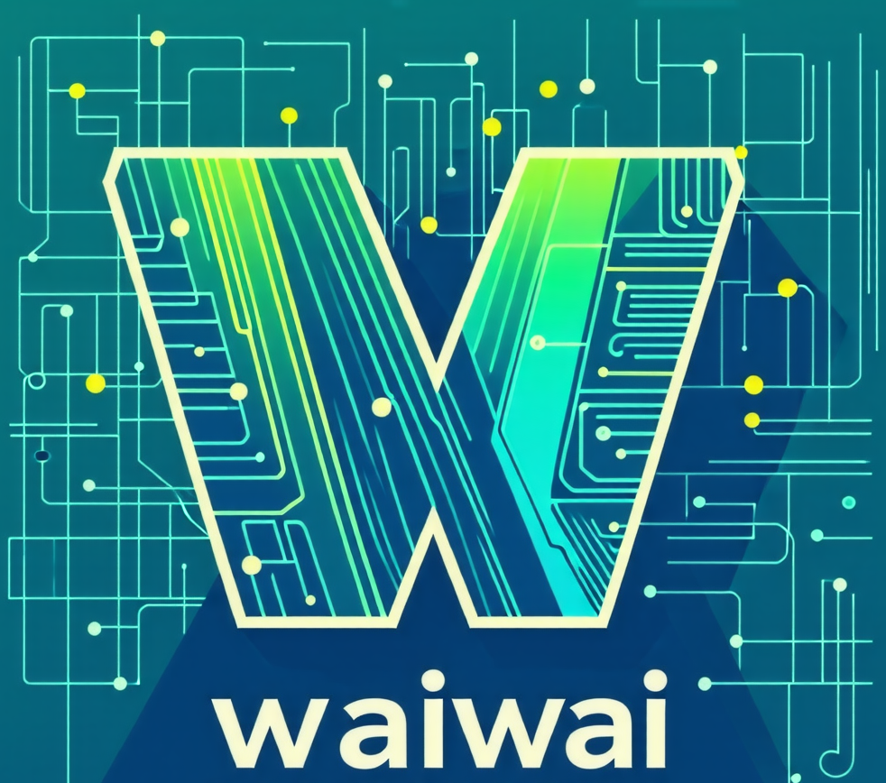

# 😄waiwai(わいわい)😄

 

  

 
This OSS is a platform that allows organizations to host data science competitions similar to Kaggle. The purpose of this OSS is to enable organizations to conduct their own data science competitions by hosting it on the cloud.

waiwai means, in Japanese, let's have "clamorously" and have fun together.

https://github.com/user-attachments/assets/788cec62-f1b2-42d4-ad14-0b43534dcdc8

## Getting Started

- For local startup, please refer to [local_develop](./docs/local_development)
- For hosting, please see [hosting](./docs/hosting).

## Contributions

PRs and issues are welcome.

## License

This project is under the MIT license.Use of this OSS is at your own risk.

## Contact

If you would like to try using the platform or want to have a proper discussion, please reach out via issues or on X (formerly Twitter) 🙇.
I can also consult about competitions (I am a Kaggle expert, just so you know).
