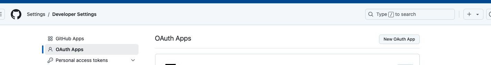
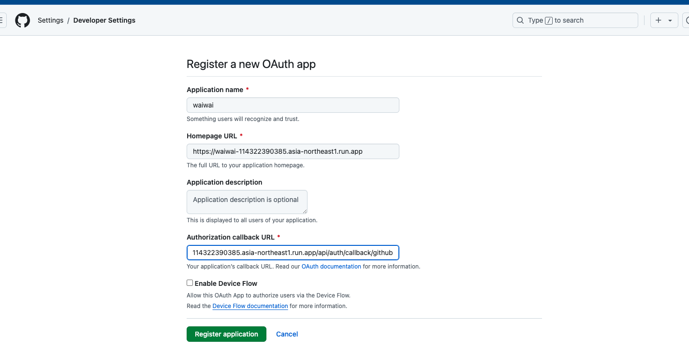

# Authentication

## Introduction

Thank you for viewing this document. This is the documentation for authentication, covering both local and production authentication.

## Prerequisites

- A GCP account is required.
- A GitHub account is required.

## Authentication

There are two methods for authentication. The first is Basic Authentication, which involves entering an email and password. The second is OAuth authentication using GitHub. It is generally recommended to use the second method for the following reasons:

- No need to store user passwords.

This document will describe how to set up OAuth using GitHub.

## GitHub OAuth

To perform GitHub OAuth authentication, two environment variables are required:

- `GITHUB_CLIENT_ID`: The OAuth client ID.
- `GITHUB_SECRET`: The OAuth client secret.

Depending on the libraries you are using, two additional environment variables may be required:

- `NEXTAUTH_URL`: Your domain (e.g., `http://localhost:3000`).
- `NEXTAUTH_SECRET`: Please create this using `openssl rand -base64 32`.

The following sections will describe how to set the `GITHUB_CLIENT_ID` and `GITHUB_SECRET`. The same procedure will be followed for both local and production environments.

## Setup Procedure

Open the page at `https://github.com/settings/developers` and click on `New OAuth App`.

The settings page will open. The `Application name` can be anything you like. For `Homepage URL`, enter `http://localhost:3000` for local development, or your domain for production. For `Authorization callback URL`, enter the path `api/auth/callback/github` appended to the `Homepage URL`. Once you have filled in the fields, click on `Register application`.

The OAuth settings have been created. Copy the string labeled `Client ID` and paste it into the `GITHUB_CLIENT_ID` environment variable. Click the button labeled `Generate a new client secret`. A secret will be generated, so copy the string and paste it into the `GITHUB_SECRET`.

That's all.
