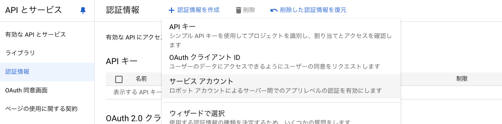
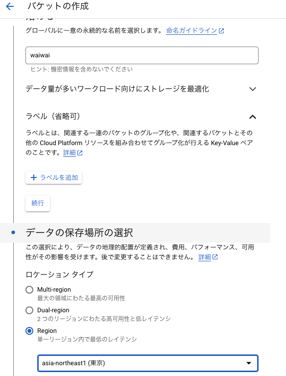
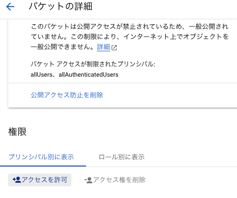
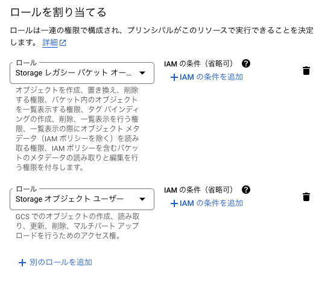
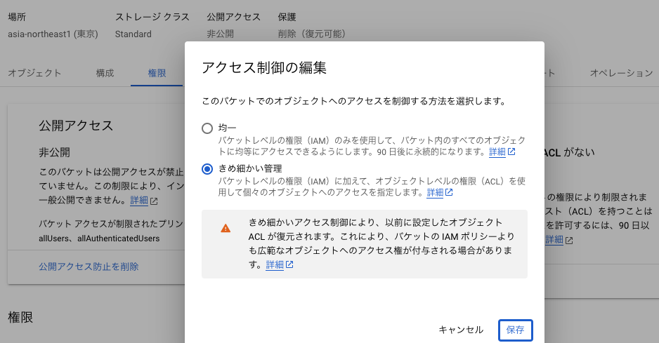
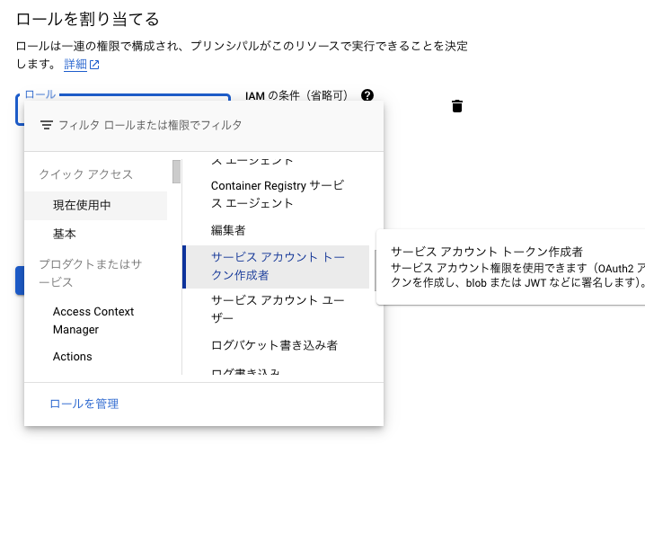
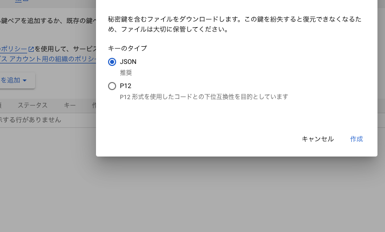

# GCP Storage

## Introduction

Thank you for viewing this document. This is the documentation for storage settings. It describes the setup for both local and production environments.

## Preparation

- GCP is required.

## GCP Storage

We will use GCP's GCS service to configure storage. This will be used to store training and test data for waiwai, as well as user-submitted files. The environment variables to be set are as follows:

- `PROJECT_ID`: The project ID in GCP
- `GCS_APPLICATION_CREDENTIALS`: The relative path to the JSON file issued when creating the service account
- `GCS_BUCKET`: The bucket name

## Setup Steps

Create a service account [here](https://console.cloud.google.com/iam-admin/serviceaccounts/create). To use GCS, you need to create a service account and set permissions. The service account defines which GCS services can be accessed and what operations are allowed. Enter the service account name and click the `Done` button. At this point, we will not set any permissions.

Create a bucket. The bucket name must be unique, so please enter a suitable name. In the image, `waiwai` is used as an example. Decide on the storage location and click the `Create` button. The bucket name you create here will be the value of `GCS_BUCKET`.

Grant access permissions. Open the details of the bucket and go to the `Permissions` tab. You should see a list of accounts that can access the bucket. Click the `Add Access` button. A sidebar will open, where you can enter the principal. The principal should be in the format `service-account-name@project-id.iam.gserviceaccount.com`. If you are unsure, check the [list here](https://console.cloud.google.com/iam-admin/serviceaccounts).

Assign permissions. This is called a role. You will need two roles: `Storage Legacy Bucket Owner` and `Storage Object Viewer`. Once you have set these, click the `Save` button.

Return to the permissions tab and click on `Switch to fine-grained access control` where it says `Access Control`. A modal will appear, so click the `Save` button. This setting allows permissions to be set at the directory or file level. For example, user profile images may not require permissions, while user-submitted files and competition data from administrators do require permissions. Switching to this mode allows for such fine-grained permission settings.

Finally, grant permission to create tokens. This is for downloading competition data. Users will need temporary access to a URL for downloading. If this permission is not granted, the operation will fail. Access [here](https://console.cloud.google.com/iam-admin/iam). Click the `Add Access` button. The principal can be the account you have been setting up. Assign the role of `Service Account Token Creator`.

Finally, issue the JSON for the service account. This is only necessary for local development. Open [this link](https://console.cloud.google.com/iam-admin/serviceaccounts/). Navigate to the created service account and go to the `Keys` tab. Click the `Add Key` button and create a private key. Place the downloaded file in the root directory. Set the path of the placed file to `GCS_APPLICATION_CREDENTIALS`. For example, `GCS_APPLICATION_CREDENTIALS=gcs-credential-dev-waiwai.json`.

That's all.
