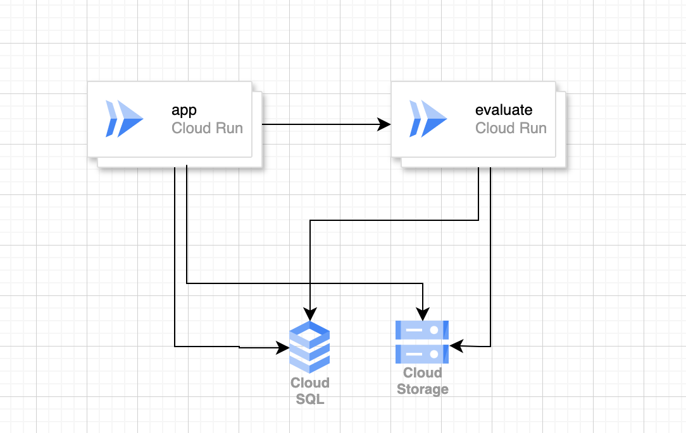
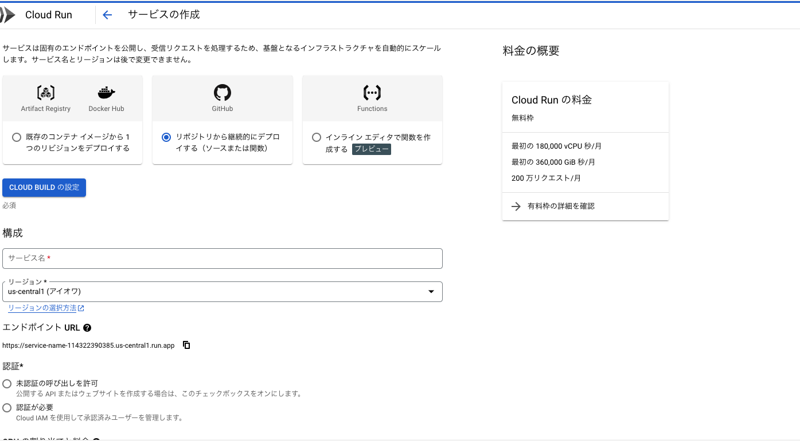
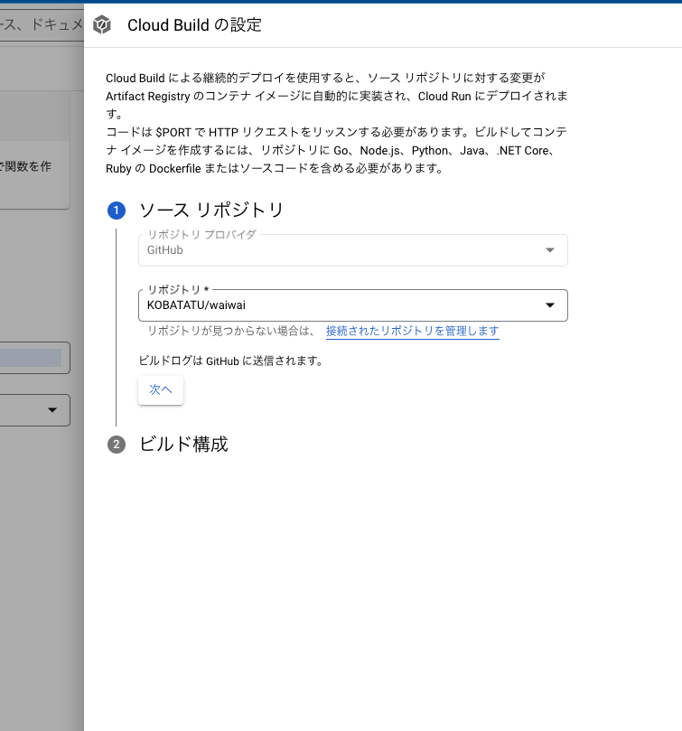
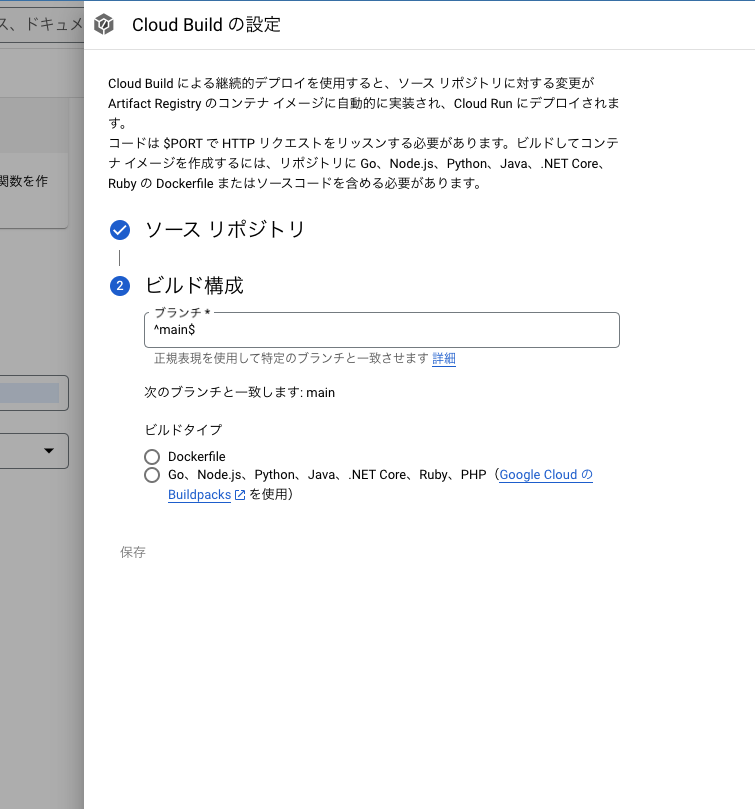
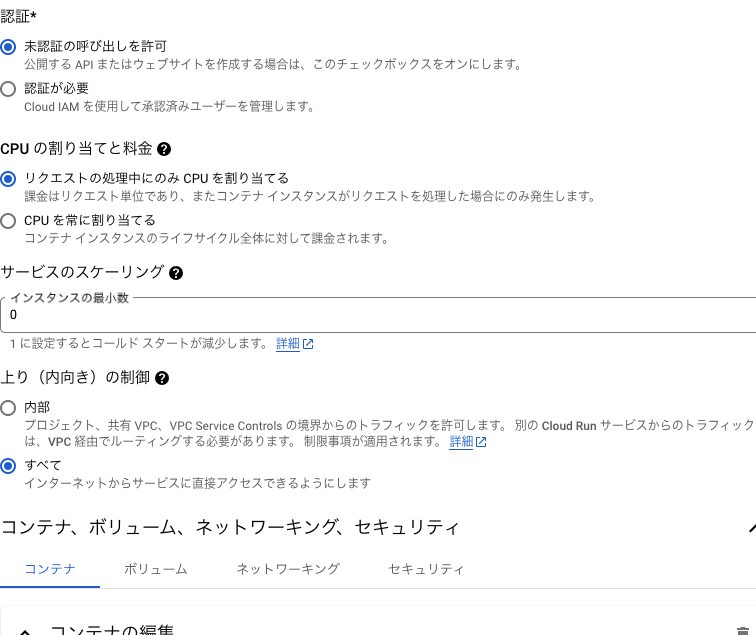
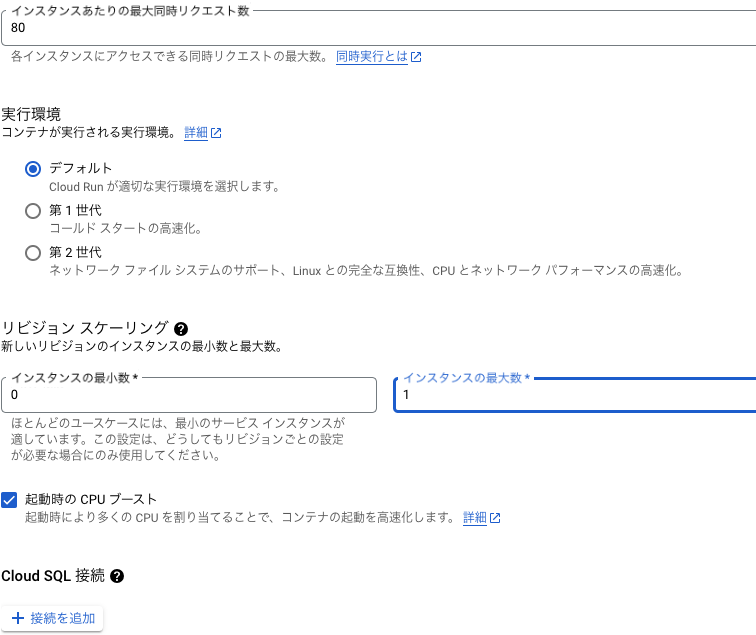
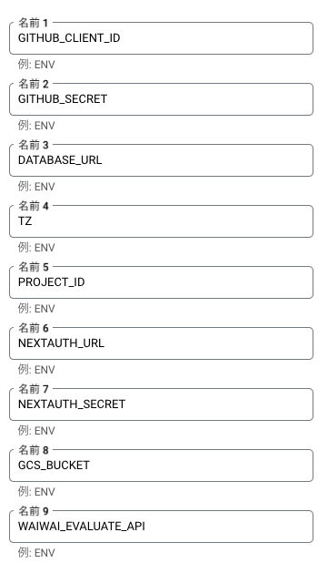
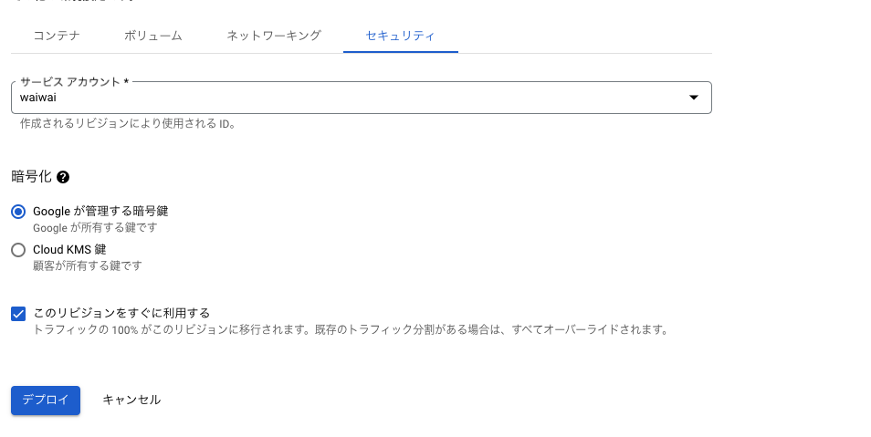

# Hosting

## Introduction

Thank you for reviewing this document. This guide outlines the steps for hosting OSS using GCP.

## Prerequisites

- GCP account is required
- Database is necessary
  - This document doesn't cover Cloud SQL setup. Please prepare a database in advance. We may add instructions if there's demand.
  - Run `npx prisma migrate deploy` for migrations.

## Architecture

The overview diagram is as follows. We'll use Cloud Run for easy server hosting.

## App

Follow these steps:

### Launch Cloud Run

First, launch Cloud Run.

Link your GitHub repository with Cloud Run. You may need to authenticate on the GitHub page.

Choose the branch for automatic deployment when pushed. `main` is fine. Select `Dockerfile` as the build method since waiwai has a Dockerfile.

Configure the remaining settings as shown in the images below.

Setup is complete.

### Authentication

Set up authentication. We use the `next-auth` library. See [here](authentication) for details.

### Service Account and GCS

Configure the service account and GCS. See [here](gcs_storage) for details.

### waiwai-evaluate

Set up the evaluation function API. Check the setup instructions in [this separate repository](https://github.com/KOBATATU/waiwai-evaluate).

### Startup

Link environment variables and service account to Cloud Run. Start with environment variables.

Open the edit screen. There's a "Variables and Secrets" tab. Set the environment variables you've created there.

Link the service account. Open the "Security" tab. Enter the created account in the Service Account section.

That's all.
